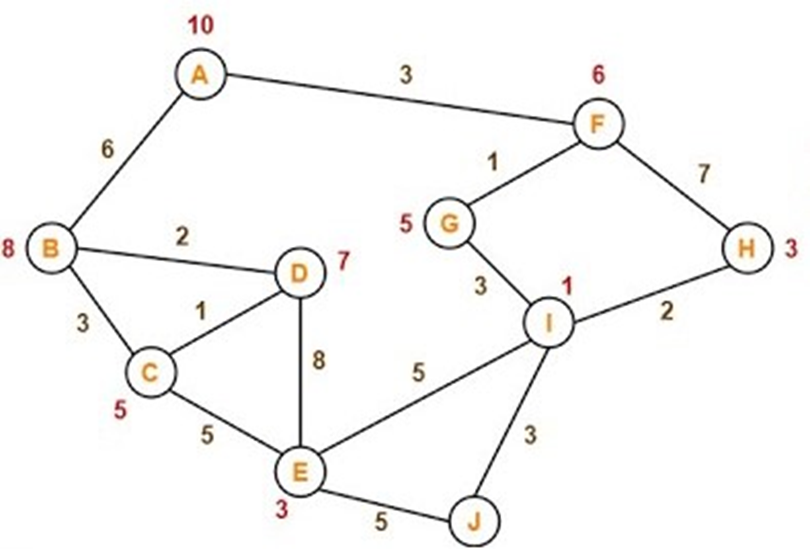
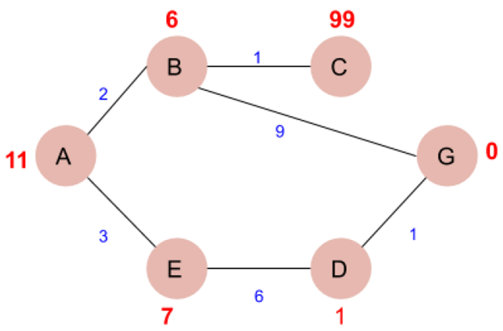

## ExpNo 4 : Implement A* search algorithm for a Graph 
## Name:       
PRAGATHI KUMAR
## Register Number:
212224230200    
## Aim:
To ImplementA * Search algorithm for a Graph using Python 3.
## Algorithm:
```
// A* Search Algorithm
1.  Initialize the open list
2.  Initialize the closed list
    put the starting node on the open 
    list (you can leave its f at zero)

3.  while the open list is not empty
    a) find the node with the least f on 
       the open list, call it "q"

    b) pop q off the open list
  
    c) generate q's 8 successors and set their 
       parents to q
   
    d) for each successor
        i) if successor is the goal, stop search
        
        ii) else, compute both g and h for successor
          successor.g = q.g + distance between 
                              successor and q
          successor.h = distance from goal to 
          successor (This can be done using many 
          ways, we will discuss three heuristics- 
          Manhattan, Diagonal and Euclidean 
          Heuristics)
          
          successor.f = successor.g + successor.h

        iii) if a node with the same position as 
            successor is in the OPEN list which has a 
           lower f than successor, skip this successor

        iV) if a node with the same position as 
            successor  is in the CLOSED list which has
            a lower f than successor, skip this successor
            otherwise, add  the node to the open list
     end (for loop)
  
    e) push q on the closed list
    end (while loop)

```
## Sample Graph I

## Sample Input:
```
10 14 
A B 6 
A F 3 
B D 2 
B C 3 
C D 1 
C E 5 
D E 8 
E I 5 
E J 5 
F G 1 
G I 3 
I J 3 
F H 7 
I H 2
A 10 
B 8 
C 5 
D 7 
E 3 
F 6 
G 5
H 3 
I 1 
J 0 
```
## Sample Output:

Path found: ['A', 'F', 'G', 'I', 'J']
## program:
```

#!/usr/bin/env python
# coding: utf-8

from collections import defaultdict

H_dist = {}

def aStarAlgo(start_node, stop_node):
    open_set = set([start_node])  # Use a set with start_node
    closed_set = set()
    g = {}  # store distance from starting node
    parents = {}  # parents contains an adjacency map of all nodes

    # Distance of starting node from itself is zero
    g[start_node] = 0
    # Start node is root node; it has no parent nodes
    # So start_node is set to its own parent node
    parents[start_node] = start_node

    while len(open_set) > 0:
        n = None
        # Node with the lowest f() is found
        for v in open_set:
            if n is None or g[v] + heuristic(v) < g[n] + heuristic(n):
                n = v

        if n is None:  # If no node found, path does not exist
            print('Path does not exist!')
            return None
        
        if n == stop_node:
            # If the current node is the stop_node,
            # then we begin reconstructing the path from it to the start_node
            path = []
            while parents[n] != n:
                path.append(n)
                n = parents[n]
            path.append(start_node)
            path.reverse()
            print('Path found: {}'.format(path))
            return path

        # Remove n from the open_list and add it to closed_list
        # because all of its neighbors were inspected
        open_set.remove(n)
        closed_set.add(n)

        for (m, weight) in get_neighbors(n):
            # Nodes 'm' not in first and last set are added to first
            # n is set its parent
            if m not in open_set and m not in closed_set:
                open_set.add(m)
                parents[m] = n
                g[m] = g[n] + weight
            else:
                if g[m] > g[n] + weight:
                    # Update g(m)
                    g[m] = g[n] + weight
                    # Change parent of m to n
                    parents[m] = n
                    # If m in closed set, remove and add to open
                    if m in closed_set:
                        closed_set.remove(m)
                        open_set.add(m)

    print('Path does not exist!')
    return None

# Define function to return neighbor and its distance from the passed node
def get_neighbors(v):
    return graph[v] if v in graph else []  # Return empty list if node has no neighbors

def heuristic(n):
    return H_dist[n] if n in H_dist else float('inf')  # Return heuristic value or inf if not found

# Describe your graph here
graph = defaultdict(list)
n, e = map(int, input("Enter number of nodes and edges: ").split())
for i in range(e):
    u, v, cost = map(str, input("Enter edge (u v cost): ").split())
    t = (v, float(cost))
    graph[u].append(t)
    t1 = (u, float(cost))
    graph[v].append(t1)

for i in range(n):
    node, h = map(str, input("Enter node and heuristic value: ").split())
    H_dist[node] = float(h)

print("Heuristic Distances:", H_dist)
print("Graph Structure:", dict(graph))

# Run the A* algorithm
start = input("Enter start node: ")
goal = input("Enter goal node: ")
aStarAlgo(start, goal)
```

## Sample Graph II:


## Sample Input:
```
6 6 
A B 2 
B C 1 
A E 3 
B G 9 
E D 6 
D G 1 
A 11 
B 6 
C 99 
E 7 
D 1 
G 0 
```
## Sample Output:

Path found: ['A', 'E', 'D', 'G']
## result:
Implementing A * Search algorithm for a Graph using Python 3. is executed successfully.
